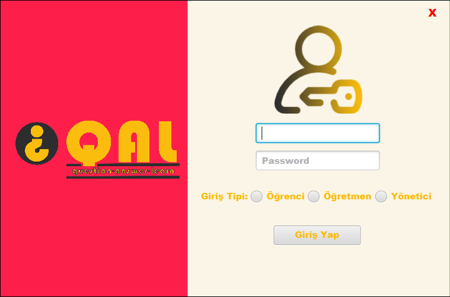
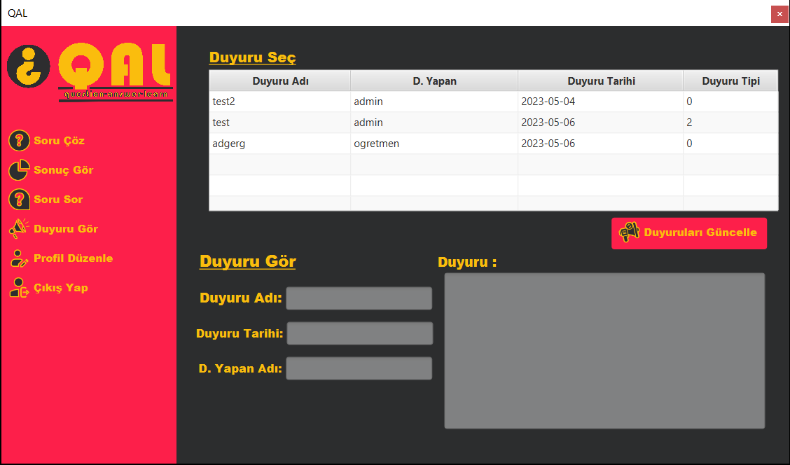

#İNFO

Günümüz eğitiminde teknoloji çok büyük alan kaplamaktadır QAL uygulamasıda bu durumdan yola çıkarak öğretmenlerin öğrencilerine konuları pekiştirmesi adına sorular sorarak ve öğrencilerin öğretmenlerine anlamadıkları kısımları sorarak daha verimli eğitim almalarını sağlamaya çalışmaktadır.

#SCREEN SHOT

NOT: DAHA FAZLA EKRAN GÖRÜNTÜSÜ İÇİN RESİMLERİN ÜSTÜNE TIKLAYINIZ.
 
 
 

#USE-CASE DİAGRAM

#Contact

 
 
